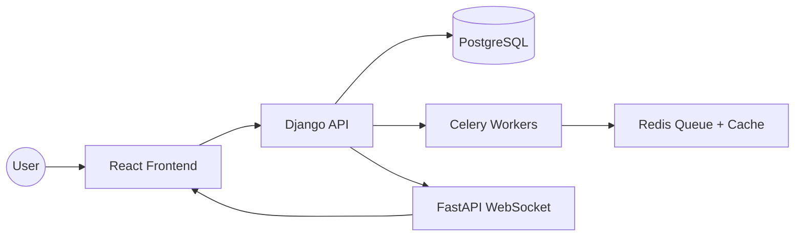

# DevPlanner – AI Project Planner

_Your intelligent assistant for planning, structuring, and documenting your own software projects._

DevPlanner is an AI-powered project planning platform that transforms a simple project idea into a complete, structured project blueprint — including sections, diagrams, technical designs, tasks, and exportable documents.  
Built with **Django**, **React**, **Celery**, **FastAPI**, and **Redis**, DevPlanner provides a scalable, modular architecture for generating consistent, reusable project plans.

---

## Overview

### Landing Page


### Home Page


---

## Features

### AI-Driven Project Generation

- Turn one prompt into a fully structured project plan
- Automatic generation of:
  - Overview
  - Features
  - Technical Stack
  - Tasks / User Stories
  - Architecture Diagrams (Mermaid)
  - Database ERD
  - System Architecture
  - Sequence Diagrams
  - Documentation Sections

### Modular Planning Structure

- Projects are divided into Sections
- Each section has multiple Versions (historical generations)
- Consistent cross-section reasoning using custom AI orchestration
- Saved plans can be reused as templates for future projects

### Backend (Django + Celery)

- RESTful APIs for project, sections, versions, diagrams, tasks
- Asynchronous AI generation tasks using Celery
- Redis for task queue + caching
- Long-running generation streaming updates through FastAPI WebSocket Server
- PostgreSQL with rich relational schema

### Frontend (React)

- Clean, responsive UI
- Realtime progress streaming for AI generation
- Version selector for each section
- Diagram preview with zoom & pan
- Dark/light themes
- Export project as **PDF**, **DOCX**, or **Markdown**

### Future Integrations

- Trello / Jira task export

---

## System Architecture



---

## Requirements

```bash
Python 3.10+

Node.js 22+

PostgreSQL 16+

Redis 7+

Docker + Docker Compose (Recommended)
```

---

## Local Development Setup

### Clone Repository

```bash
git clone https://github.com/hoangdanh165/DevPlanner-Deployment.git
cd devplanner-deployment
```

### Backend Setup (Django)

```bash
cd backend
pip install -r requirements.txt
cp .env.example .env
python manage.py migrate
python manage.py runserver
```

### Frontend Setup (React)

```bash
cd frontend
npm install
npm run dev
```

### WebSocket Server (FastAPI)

```bash
cd websocket
pip install -r requirements.txt
uvicorn app.main:app --reload --host 0.0.0.0 --port 8001
```

### Celery Worker

```bash
celery -A backend worker -l INFO -P solo
```

### Run with Docker (Recommended)

```bash
docker compose up --build
```

## License

MIT License — free for personal & commercial use.
